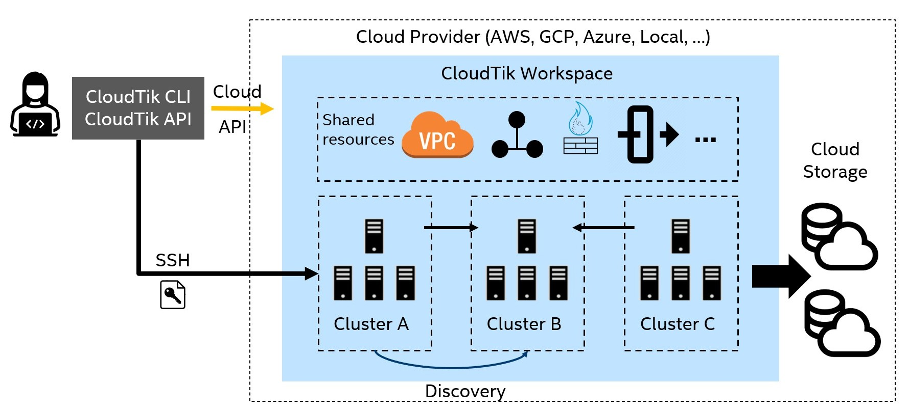

# CloudTik: Cloud Scale Platform for Distributed Analytics and AI

## Introduction

### The Problem
Building and operating fully distributed and high performance data analytics and AI platform are complex and time-consuming.
This is usually not possible for small or middle enterprises not saying individuals.

While the existing solutions for solving distributed analytics and AI problems on cloud
have major challenges on a combination of various aspects cared by users.
These include high cost for software services, non-optimal performance on the corresponding hardware,
the complexity of operating and running such a platform and lack of transparency.

### CloudTik Solution
CloudTik is designed for solving the above challenges by providing the following core capabilities:
- Scalable, robust, and unified control plane and runtimes for all public clouds
- Out of box optimized runtimes for analytics and AI (Spark, ...)
- Support of major public cloud providers - AWS, Azure, GCP, Kubernetes (EKS, AKS, and GKE) and more
- A fully open architecture and open-sourced platform

### Who Will Use CloudTik
CloudTik enables researchers, data scientists, and enterprises to easily create and manage analytics and AI platform on public clouds,
with out-of-box optimized functionalities and performance, and to go quickly to focus on running the business workloads
in hours or in even minutes instead of spending months to construct and optimize the platform.

## CloudTik Architecture

Blow diagram shows the high level concept architecture of CloudTik.



User can use CloudTik through a command line interface (CLI) or a python application programming interface (API).
Both CLI and API provides the management operations for both workspace and cluster, for example creating a workspace or
starting a cluster.

The same CLI and API can operate on different cloud providers with a unified workspace and cluster design shown
in the right part of the diagram.

The CLI or API interacts with Cloud through two channels. It will use Cloud API to create or manage cloud provider
resources such as launching or terminating a VM instance on cloud. It will use SSH to interact with the VM instance
to perform tasks like installing, configuring and managing the services running on the VM instance.

When a workspace for specific cloud provider is created, all the shared resources for implementing the unified
design are created. These include network resources (like VPC, subnets, NAT gateways, firewall rules),
instance profiles, cloud storage and so on. Although the actual resources varies between cloud providers while
the design the resources achieved is consistent.

Within a workspace, one or more clusters can be started. These clusters will share a lot of common configurations
such as network (they are in the same VPC) but vary on other aspects including instance types, scale of the cluster,
services running and so on. The services provided by one cluster can be discovered by other clusters
and be consumed.

For each cluster started, user can configure very easily which runtimes
(such as Spark runtime or Machine Learning runtime) are needed.
CloudTik has designed the runtime with the optimized configurations and libraries.
And when the cluster is running, the runtimes are properly configured and ready for running your workload.

## Getting Started with CloudTik

### 1. Preparing Python environment

CloudTik requires a Python environment on Linux. We recommend using Conda to manage Python environments and packages.

If you don't have Conda installed, please refer to `dev/install-conda.sh` to install Conda on Linux.

```
git clone https://github.com/oap-project/cloudtik.git && cd cloudtik
bash dev/install-conda.sh
```

Once Conda is installed, create an environment with a specific Python version as below.
CloudTik currently supports Python 3.7, 3.8, 3.9. Take Python 3.7 for example,

```
conda create -n cloudtik -y python=3.7
conda activate cloudtik
```

### 2. Installing CloudTik

Execute the following `pip` commands to install CloudTik on your working machine for specific cloud providers. 

Take AWS for example,

```
# if running CloudTik on aws
pip install -U "cloudtik[aws] @ https://d30257nes7d4fq.cloudfront.net/downloads/cloudtik/cloudtik-0.9.1-cp37-cp37m-manylinux2014_x86_64.whl"
```

Replace `cloudtik[aws]` with `clouditk[azure]` or `cloudtik[gcp]` if you want to create clusters on Azure or GCP.
Use `cloudtik[all]` if you want to manage clusters with all supported Cloud providers.

The following table shows the installation links for latest CloudTik wheels of supported Python versions. 

| Linux      | Installation                                                                                                                                       |
|:-----------|:---------------------------------------------------------------------------------------------------------------------------------------------------|
| Python 3.9 | `pip install -U "cloudtik[aws] @ https://d30257nes7d4fq.cloudfront.net/downloads/cloudtik/cloudtik-0.9.1-cp39-cp39-manylinux2014_x86_64.whl" `     |
| Python 3.8 | `pip install -U "cloudtik[aws] @ https://d30257nes7d4fq.cloudfront.net/downloads/cloudtik/cloudtik-0.9.1-cp38-cp38-manylinux2014_x86_64.whl" `     |
| Python 3.7 | `pip install -U "cloudtik[aws] @ https://d30257nes7d4fq.cloudfront.net/downloads/cloudtik/cloudtik-0.9.1-cp37-cp37m-manylinux2014_x86_64.whl" `    |


### 3. Authentication to Cloud Providers API

After CloudTik is installed on your working machine, you need to configure or log into your Cloud account to 
authenticate the cloud provider CLI on this machine.

#### AWS

First, install AWS CLI (command line interface) on your working machine. Please refer to
[Installing AWS CLI](https://docs.aws.amazon.com/cli/latest/userguide/getting-started-install.html)
for detailed instructions.

After AWS CLI is installed, you need to configure AWS CLI about credentials. The quickest way to configure it 
is to run `aws configure` command, and you can refer to
[Managing access keys](https://docs.aws.amazon.com/IAM/latest/UserGuide/id_credentials_access-keys.html#Using_CreateAccessKey)
to get *AWS Access Key ID* and *AWS Secret Access Key*.

More details for AWS CLI can be found in [AWS CLI Getting Started](https://github.com/aws/aws-cli/tree/v2#getting-started).

#### Azure

After CloudTik is installed on your working machine, login to Azure using `az login`.
Refer to [Sign in with Azure CLI](https://docs.microsoft.com/en-us/cli/azure/authenticate-azure-cli) for more details.

#### GCP

If you use service account authentication, follow [Creating a service account](https://cloud.google.com/docs/authentication/getting-started#creating_a_service_account)
to create a service account on Google Cloud. 

A JSON file should be safely downloaded to your local computer, and then set the `GOOGLE_APPLICATION_CREDENTIALS` environment
variable as described in the [Setting the environment variable](https://cloud.google.com/docs/authentication/getting-started#setting_the_environment_variable)
on your working machine.

If you are using user account authentication, refer to [User Guide: Login to Cloud](https://cloudtik.readthedocs.io/en/latest/UserGuide/login-to-cloud.html#gcp) for details.

### 4. Creating a Workspace for Clusters.
Once you authenticated with your cloud provider, you can start to create a Workspace.

CloudTik uses **Workspace** concept to easily manage shared Cloud resources such as VPC network resources,
identity and role resources, firewall or security groups, and cloud storage resources.
By default, CloudTik will create a workspace managed cloud storage
(S3 for AWS, Data Lake Storage Gen 2 for Azure, GCS for GCP) for use without any user configurations.
Within a workspace, you can start one or more clusters with different combination of runtime services.

Create a configuration workspace yaml file to specify the unique workspace name, cloud provider type and a few cloud 
provider properties. 

Take AWS for example,

```
# A unique identifier for the workspace.
workspace_name: example-workspace

# Cloud-provider specific configuration.
provider:
    type: aws
    region: us-west-2
    # Use allowed_ssh_sources to allow SSH access from your client machine
    allowed_ssh_sources:
      - 0.0.0.0/0
```
*NOTE:* `0.0.0.0/0` in `allowed_ssh_sources` will allow any IP addresses to connect to your cluster as long as it has the cluster private key.
For more security, you need to change from `0.0.0.0/0` to restricted CIDR ranges for your case.

Use the following command to create and provision a Workspace:

```
cloudtik workspace create /path/to/your-workspace-config.yaml
```

Check `example/cluster` folder for more Workspace configuration file examples.

If you encounter problems on creating a Workspace, a common cause is that your current login account
for the cloud doesn't have enough privileges to create some resources such as VPC, storages, public ip and so on.
Make sure your current account have enough privileges. An admin or owner role will give the latest chance to have
all these privileges.

### 5. Starting a cluster with Spark runtime

Now you can start a cluster running Spark by default:

```
cloudtik start /path/to/your-cluster-config.yaml
```

A typical cluster configuration file is usually very simple thanks to design of CloudTik's templates with inheritance.

Take AWS for example,

```
# An example of standard 1 + 3 nodes cluster with standard instance type
from: aws/standard

# Workspace into which to launch the cluster
workspace_name: example-workspace

# A unique identifier for the cluster.
cluster_name: example

# Cloud-provider specific configuration.
provider:
    type: aws
    region: us-west-2

auth:
    ssh_user: ubuntu
    # Set proxy if you are in corporation network. For example,
    # ssh_proxy_command: "ncat --proxy-type socks5 --proxy your_proxy_host:your_proxy_port %h %p"

available_node_types:
    worker.default:
        # The minimum number of worker nodes to launch.
        min_workers: 3
```
This example can be found in CloudTik source code folder `example/cluster/aws/example-standard.yaml`.

You need only a few key settings in the configuration file to launch a Spark cluster.

As for `auth` above, please set proxy if your working node is using corporation network.

```
auth:
    ssh_user: ubuntu
    ssh_proxy_command: "ncat --proxy-type socks5 --proxy <your_proxy_host>:<your_proxy_port> %h %p"
```

The cluster key will be created automatically for AWS and GCP if not specified.
The created private key file can be found in .ssh folder of your home folder.
For Azure, you need to generate an RSA key pair manually (use `ssh-keygen -t rsa -b 4096` to generate a new ssh key pair).
and configure the public and private key as following,

```
auth:
    ssh_private_key: ~/.ssh/my_cluster_rsa_key
    ssh_public_key: ~/.ssh/my_cluster_rsa_key.pub
```

Refer to `example/cluster` directory for more cluster configurations examples.

### 6. Managing clusters

CloudTik provides very powerful capability to monitor and manage the cluster.

#### Cluster status and information

Use the following commands to show various cluster information.

```
# Check cluster status with:
cloudtik status /path/to/your-cluster-config.yaml

# Show cluster summary information and useful links to connect to cluster web UI.
cloudtik info /path/to/your-cluster-config.yaml
cloudtik head-ip /path/to/your-cluster-config.yaml
cloudtik worker-ips /path/to/your-cluster-config.yaml
```
#### Attach to the cluster head (or specific node)

Connect to a terminal of cluster head node.

```
cloudtik attach /path/to/your-cluster-config.yaml
```

#### Execute and Submit Jobs

Execute a command via SSH on cluster head node or a specified node.

```
cloudtik exec /path/to/your-cluster-config.yaml [command]
```

#### Manage Files

Upload files or directories to cluster.

``` 
cloudtik rsync-up /path/to/your-cluster-config.yaml [source] [target]
```
  
Download files or directories from cluster.

```
cloudtik rsync-down /path/to/your-cluster-config.yaml [source] [target]
```

### 7. Tearing Down

#### Terminate a Cluster

Stop and delete the cluster.

```
cloudtik stop /path/to/your-cluster-config.yaml
```

#### Delete the Workspace

Delete the workspace and all the network resources within it.

```
cloudtik workspace delete /path/to/your-workspace-config.yaml
```
Be default, the managed cloud storage will not be deleted.
Add --delete-managed-storage option to force deletion of manged cloud storage.

For more information as to the commands, you can use `cloudtik --help` or `cloudtik [command] --help` to get detailed instructions.
