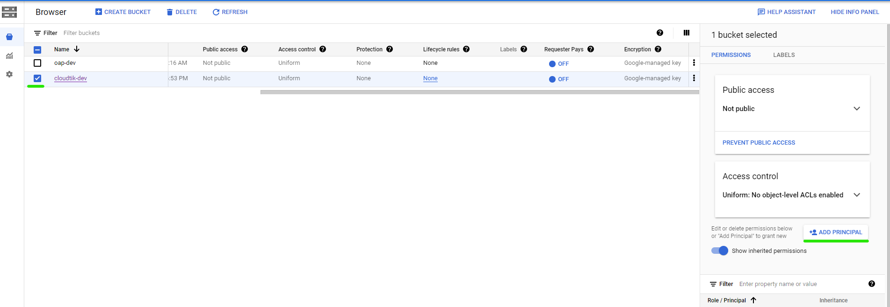

### Configuring GCS Bucket

If you do not already have a GCS bucket, create one and configure its permission for your [service account](https://cloud.google.com/docs/authentication/getting-started#creating_a_service_account).

Select your bucket, then click **ADD PRINCIPLE**.

Fill the first item with your service account email and select a role: Storage Admin.

