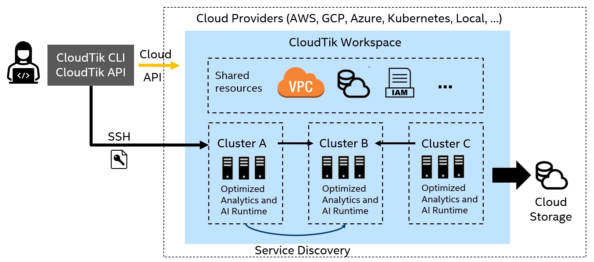

# Architecture Overview
This section gives an overview of the CloudTik Architecture. Although to understand the system
architecture is not a must for users of CloudTik, it will be helpful for user to master CloudTik
more easily if such knowledge is in mind.

- [High Level Architecture](#high-level-architecture)
- [Cluster Architecture](#cluster-architecture)
- [Head and Worker Services](#head-and-worker-services)
- [Cluster Controller](#cluster-controller)
- [Runtime Design](#runtime-design)
- [Execution Mode](#execution-mode)

## High Level Architecture
Blow diagram shows the high level system architecture of CloudTik.

User can use CloudTik through a command line interface (CLI) or a python application programming interface (API).
Both CLI and API provides the management operations for both workspace and cluster, for example creating a workspace or
starting a cluster.

The same CLI and API can operate on different cloud providers with a unified workspace and cluster design shown
in the right part of the diagram.

When a workspace for specific cloud provider is created, all the shared resources for implementing the unified
design are created. These include network resources (like VPC, subnets, NAT gateways, firewall rules),
instance profiles, cloud storage and so on. Although the actual resources varies between cloud providers while
the design the resources achieved is consistent.

Within a workspace, one or more clusters can be started. These clusters will share a lot of common configurations
such as network (they are in the same VPC) but vary on other aspects including instance types, scale of the cluster,
services running and so on. The services provided by one cluster can be discovered by other clusters
and be consumed.

The CLI or API interacts with Cloud through two channels. It will use Cloud API to create or manage cloud provider
resources such as launching or terminating a VM instance on cloud. It will use SSH to interact with the VM instance
to perform tasks like installing, configuring and managing the services running on the VM instance.

## Cluster Architecture
Blow diagram shows the cluster architecture and a general internal steps when starting a cluster.

Let's zoom in to have a closer look to a single cluster. A CloudTik cluster includes one head and
zero or more workers.

The head node has a public IP which can be connected through SSH. While the worker nodes are all in
a private subnet which is not directly accessible from Internet.

The process of starting a cluster:
- CLI/API calls Cloud API to launch a head instance.
- Once the head instance is launched, CLI/API connect to head node through SSH, install and configure the head node. And run all head services on head node. Once head node is ready and running, the cluster launch from CLI/API is finished.
- Cluster controller from head node calls Cloud API to launch worker instances.
- For each worker instance launched, Cluster Controller connects to the worker node through SSH, install and configure the worker node, run all worker services, all in parallel.

## Head and Worker Services
Let's have a look to what services are running on head node and worker nodes.

Head node is the brain of the cluster. It runs the core services for both CloudTik and the runtimes such as Spark.
Head node runs the following services:
- Core Services
  - Cluster Controller: Responsible for creating, setting up, or terminating worker instances.
  - Redis Shards: Multiple Redis instance for serving shared cluster state.
  - Node Controller: Heart beating and monitoring node and services health.
- Runtime Services
  - Head services of Runtimes (depending on what Runtimes are enabled).

Worker nodes are horse force providing computation power. On worker node, it runs the following services.
- Core Services
  - Node Controller: Heart beating and monitoring node and services health.
- Runtime Services
  - Worker services of Runtimes (depending on what Runtimes are enabled).

## Cluster Controller
As mentioned that cluster controller is the braining of cluster scaling capabilities.
Below shows the key controller loop for what cluster controller does for managing the scaling and cluster availability.

First, Cluster Controller keep checking the active non-terminated nodes for cluster and keep the minimal
number of workers satisfied. If one or more nodes are terminated for any reasons, Cluster Controller
will launch the corresponding number of new nodes to make sure the minimal number of workers.

Second, Cluster Controller keep checking whether a launched node needs to be installed, configured and run its services.
This is happening when a new worker is launched. And it will be also useful when a node gets into bad state and needs a recovery.

Third, Cluster Controller will try to recover the unhealthy node and terminate it after a few failed tries.
Once a node is terminated, it might trigger the creation of a fresh new node if there is no minimal number of workers.

Fourth, Cluster Controller will respond to request for scaling up and down by launching new nodes or terminate
nodes to satisfy the resource requirements.

Finally, Cluster Controller provides various coordinating services to the runtime such as allocating unique node id
to each node.

## Runtime Design
Belows diagram shows the current design of analytics runtimes (AI to come).

CloudTik targets to support a systematic of analytics and AI services to efficiently solve
end-to-end and distributed analytics and AI problems.

For now, we support a distributed analytics environment by using a combination of runtimes.
We will continue to optimize and advance to include AI features as next step.

## Execution Mode
CloudTik supports two execution mode: Host mode and Container mode.

For Host mode, all CloudTik and runtime services are running directly on the VM instance
launched from the cloud provider. The software packages are downloaded, installed and configured
on the fly of cluster creation process.

For Container mode, all CloudTik and runtime services are running in a Docker container running
on the VM instance. Docker will be installed and configured automatically after the VM is launched.
The software packages can be preinstalled in Docker image so that the cluster launched time can be saved
if the package download is slow. In this mode, almost all the management operations and commands will be run in the container
instead of on the VM instance. Container mode is enabled by default.

CloudTik will handle transparently for user as to the difference of the two modes.
