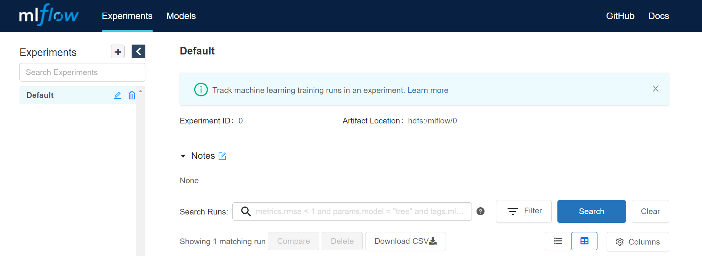

# Run AI Examples on Cloudtik cluster


#### E2E_MLflow_HyperOpt_Scikit-Learn
1. Uploading example notebook and run
 
Upload example notebook [E2E_MLflow_HyperOpt_Scikit-Learn](./E2E_MLflow_HyperOpt_Scikit-Learn.ipynb) to JupyterLab or $HOME/runtime/jupyter.

Open this notebook on JupyterLab, and choose the Python 3 kernel to run the notebook.

2. Checking the MLflow Server

Type the below URL in your browser
```
http://<head_IP>:5001
```
If the MLflow Server have started, you can see the below UI.

