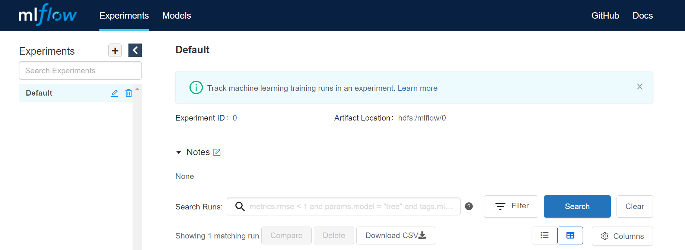

# Run AI Examples on Cloudtik cluster


Here we provide a guide for you to run some AI related examples using many popular open-source libraries. 


#### MLflow HyperOpt Scikit_Learn

This notebook uses scikit-learn to illustrate a complete end-to-end example of loading data, training a model, distributed hyperparameter tuning, and model inference. It also illustrates how to use MLflow and Model Registry.

1. Uploading example notebook and run
 
Upload example notebook [MLflow_HyperOpt_Scikit-Learn](notebooks/mlflow_hyperopt_scikit_learn.ipynb) to JupyterLab or $HOME/runtime/jupyter.

2. Open this notebook on JupyterLab, and choose the Python 3 kernel to run the notebook.

3. Checking the MLflow Server

Type the below URL in your browser
```
http://<head_IP>:5001
```
If the MLflow Server have started, you can see the below UI.




#### Mlflow HyperOpt Horovod on Spark

This example is to train a simple ConvNet on the MNIST dataset using Keras + Horovod using Cloudtik Spark Runtime.
 
1. Upload example notebook [Mlflow_HyperOpt_Horovod-on-Spark](notebooks/mlflow_hyperopt_horovod_on_spark.ipynb) to JupyterLab or $HOME/runtime/jupyter.

2. Open this notebook on JupyterLab, and choose the Python 3 kernel to run the notebook.